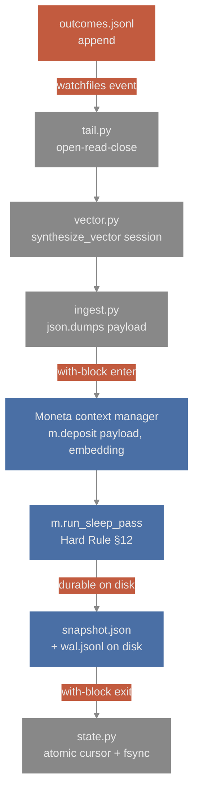
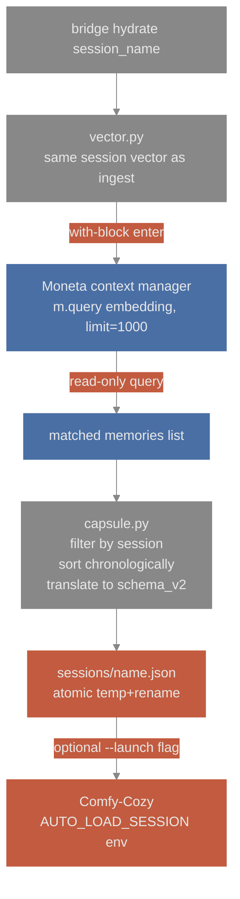
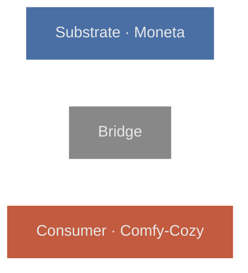

# comfy-moneta-bridge

Wires [Comfy-Cozy](https://github.com/JosephOIbrahim/Comfy-Cozy)'s
autonomous ComfyUI agent into [Moneta](https://github.com/JosephOIbrahim/Moneta)'s
cognitive substrate. Cross-session memory for generative workflows.


## Architecture

The bridge is a thin file-watcher + writer. It does not modify Comfy-Cozy
or Moneta source; both are frozen as law.



Ingest path: Comfy-Cozy outcomes flow through the bridge into Moneta's
substrate. Hard Rule §12 (`run_sleep_pass()`) makes each deposit durable
before the cursor advances.



Hydrate path: a session capsule is reconstructed from Moneta state and
written into Comfy-Cozy's session folder. Optionally, the bridge spawns
Comfy-Cozy with `AUTO_LOAD_SESSION` set.



Substrate (Moneta) · Bridge · Consumer (Comfy-Cozy)


## Quickstart

```sh
pip install -e .
# In one terminal:
bridge tail
# In another, after some outcomes have been generated:
bridge hydrate default --launch
```

Defaults:

- `--comfy-cozy-root`: `G:/Comfy-Cozy`
- `--moneta-storage`: `~/.comfy-moneta-bridge/moneta/`
- `--state-dir`: `~/.comfy-moneta-bridge/`


## What the bridge does

### Ingest path

`bridge tail`:

1. **Watches** `{comfy-cozy-root}/sessions/*_outcomes.jsonl` via `watchfiles`.

2. **On each filesystem event,** opens the file in binary mode, seeks to the
   cursor offset, reads, closes — never holds a file handle persistently.

3. **Decodes** utf-8 explicitly per line, parses JSON, validates
   `schema_version == 1`.

4. **Synthesizes** a deterministic 384-dim unit vector from the outcome's
   `session` string (sha256 -> seeded `random.Random` -> gauss draws ->
   L2-normalize). Stdlib only.

5. **Opens** an ephemeral `Moneta(...)` handle, calls `deposit(payload,
   embedding)` and then `run_sleep_pass()` — the latter is mandatory for
   durability (Hard Rule §12); without it the deposit is silently lost
   on handle close.

6. **After the with-block exits cleanly,** advances the cursor file
   atomically (temp + fsync + os.replace).

### Hydrate path

`bridge hydrate <session>`:

1. **Synthesizes** the same session vector.

2. **Opens** an ephemeral handle, calls `m.query(embedding, limit=1000)`.

3. **Filters** by `payload["session"] == <session>` (PRNG-collision guard).

4. **Sorts** chronologically by `timestamp`.

5. **Translates** each outcome to Comfy-Cozy `schema_version=2`:
   `vision_notes` -> notes type=`observation`; `key_params` +
   `quality_score` -> notes type=`preference`.

6. **Atomic write** to `{comfy-cozy-root}/sessions/{name}.json`.

The capsule loads on Comfy-Cozy startup if `AUTO_LOAD_SESSION=<name>`
is set. `bridge hydrate --launch` spawns Comfy-Cozy with that env.


## v0 limitations

These are documented failure modes; each has a concrete v1 remediation.

### Survivorship bias

Only successful outcomes are captured by Comfy-Cozy's `record_outcome`
path. Failed pipeline runs and abandoned goals may not be persisted in
v0. *v1 candidate.*

### Cursor-loss idempotency

If `~/.comfy-moneta-bridge/cursor.json` is deleted, replaying the JSONL
produces duplicate Moneta deposits. Cursor durability is the v0
idempotency mechanism; loss = some duplicates. *v1 candidate.*

### Synthetic vectors

v0 uses session-keyed deterministic vectors; there is no semantic
similarity between distinct sessions. Same session retrieves all its
memories; cross-session learning is not available. *v1 candidate: real
embeddings (sentence-transformers or remote API).*

### Performance ceiling at WAL ≈ 1000

Each ingest call snapshots the entire ECS to disk inside
`run_sleep_pass()`. Mean per-cycle latency, measured on Phase 0.5b's
benchmark:

| ECS size | mean | p99 | comment |
| --- | --- | --- | --- |
| 0       | 28 ms     | 47 ms     | demo conditions |
| 100     | 76 ms     | 109 ms    | demo upper bound |
| 1,000   | **685 ms** | 736 ms   | past mission STOP threshold |
| 10,000  | 4,518 ms  | 6,505 ms  | unusable |

v0 is comfortable for demo workloads (~100 outcomes per session).
Production beyond ~1,000 outcomes per session requires the *v1
batched-deposit layer*.


## Repository layout

```
comfy_moneta_bridge/
  vector.py        deterministic synthetic embedder
  state.py         CursorStore with atomic write + fsync
  tail.py          rotation-aware JSONL tailer
  ingest.py        deposit + run_sleep_pass pipeline
  capsule.py       Moneta query -> schema_v2 capsule writer
  launch.py        Comfy-Cozy spawn with AUTO_LOAD_SESSION
  cli.py           typer CLI: bridge tail / bridge hydrate
tests/             49 tests (mocked + real-Moneta integration)
scripts/           Phase 0.5b probes (dimensionality, durability, benchmark)
docs/architecture.md   longer-form architecture notes
demo/              workflow.json + shot_list.md for the demo arc
```


## Build provenance

- Pre-flight: `MONETA_API_SCOUT.md` (Phase 0.5a + 0.5b addendum)
- Constitution: `AGENT_COMMANDMENTS.md`
- Mission specs: `BRIDGE_BUILD_MISSION_v3_1.md` (active),
  `BRIDGE_BUILD_MISSION_v3.md` (superseded, retained for provenance)


## License

Proprietary. Matches the Moneta and Comfy-Cozy license posture.
